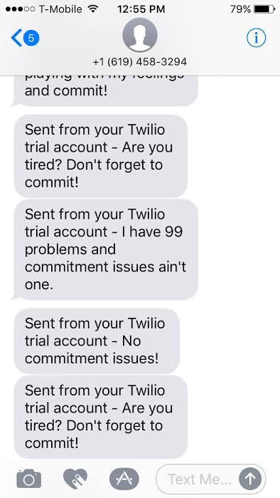

# Problem/Solution:
Do you have commitment issues? Ever fear that your computer will explode while you code, causing you to lose all your work? Well I have the solution for you!

Commitment Issues is a web application that sends a text message to your phone every hour to remind you to commit your work. It is a project aimed at junior developers who are still new to using Git.

# Goal:
To help people get over their commitment issues.

# Tech Stack:
- Sinatra
- Javascript
- Ruby
- HTML
- CSS
- Bootstrap
- Twilio API
